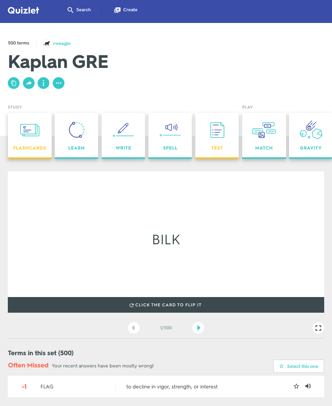
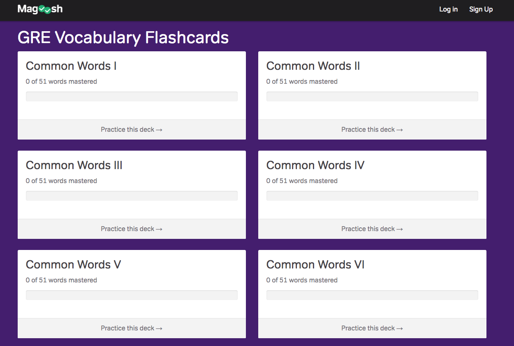
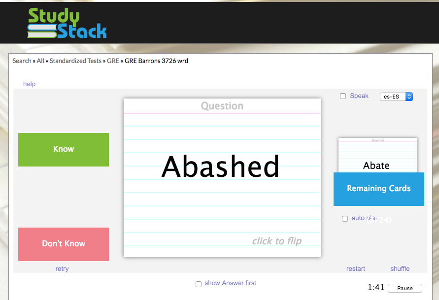

# GREFlashCards

Full Stack CRUD app to add words for improving vocabulary in preparation for the GRE

### Reference Apps

https://quizlet.com/300134/kaplan-gre-flash-cards/

https://gre.magoosh.com/flashcards/vocabulary/decks

https://www.studystack.com/flashcard-579355

